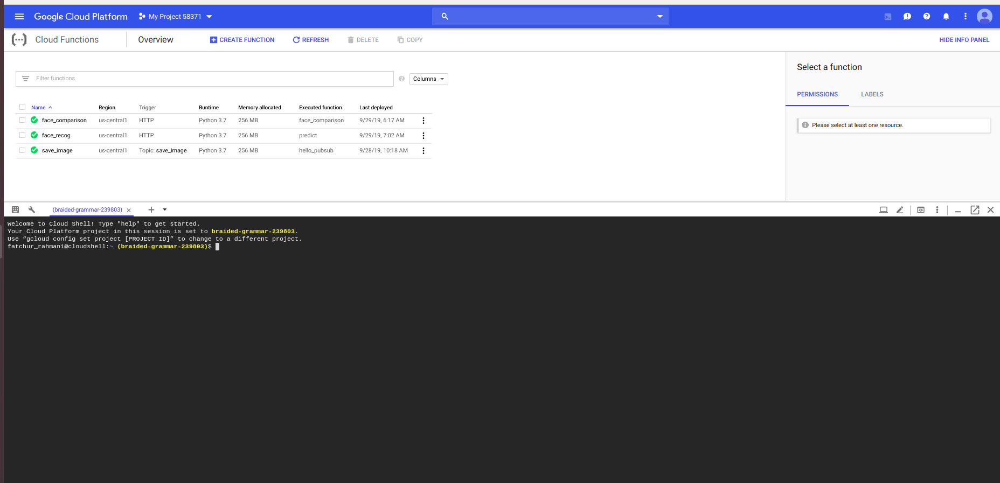

# Note
In this section, we will make a face searcher based on the incoming face feature and face dataset in bigquery.

## Steps
### Create face features table in GBQ
- open cloud shell    
- horey, now your gcp cloud shell is open 
- then make a folder `telkom/` ==>> `mkdir telkom`
- enter the telkom directory ==>> `cd telkom`
- create `create_feature_table.py` ==>> `touch create_feature_table.py`
- then ==>> `nano create_feature_table.py`
- open the `create_bq_table.py` IN THIS REPO
- CHANGE the **table id** based on your table id name
- then, copy the code from `create_bq_table.py` to your cloud shell
- save it ==>> `ctrl + x`
- execute it ==>> `python3 create_feature_table.py`


### Then create the cloud function 
- On the spot explanantion

### Horey, test ypur function now
- endpoint (on the spot explanation)
- Request format
```python
{
  "predictions": [
    {
      "output":  <512 face feature list as float>
    }
  ]
}
```
- Response format
```python
{
    "rank1": {
        "id": "9672ddf0-e214-11e9-9102-bbe10957af15",
        "name": "jkw",
        "distance": 0
    },
    "rank2": {
        "id": "9a70d16e-e214-11e9-9102-bbe10957af15",
        "name": "jkw",
        "distance": 0
    },
    "rank3": {
        "id": "509b3484-e2a1-11e9-b68c-4b7701cc39be",
        "name": "jkw",
        "distance": 0
    }
}
```


